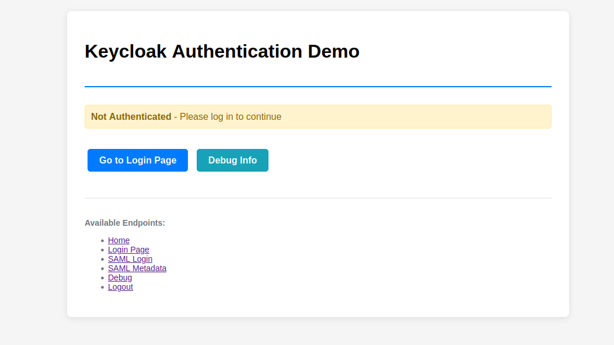
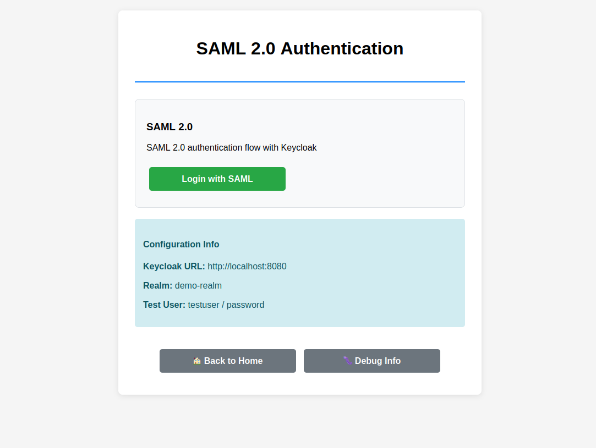
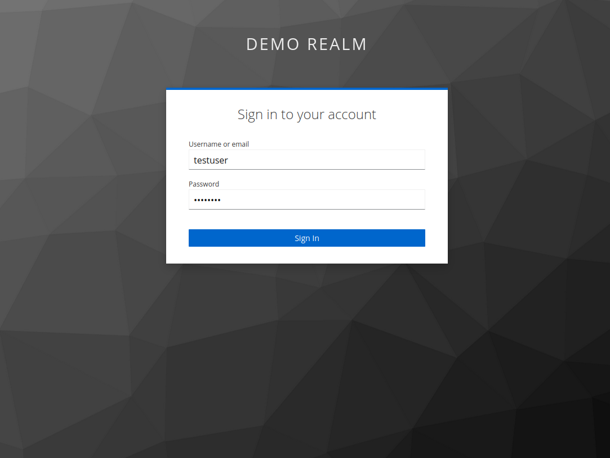
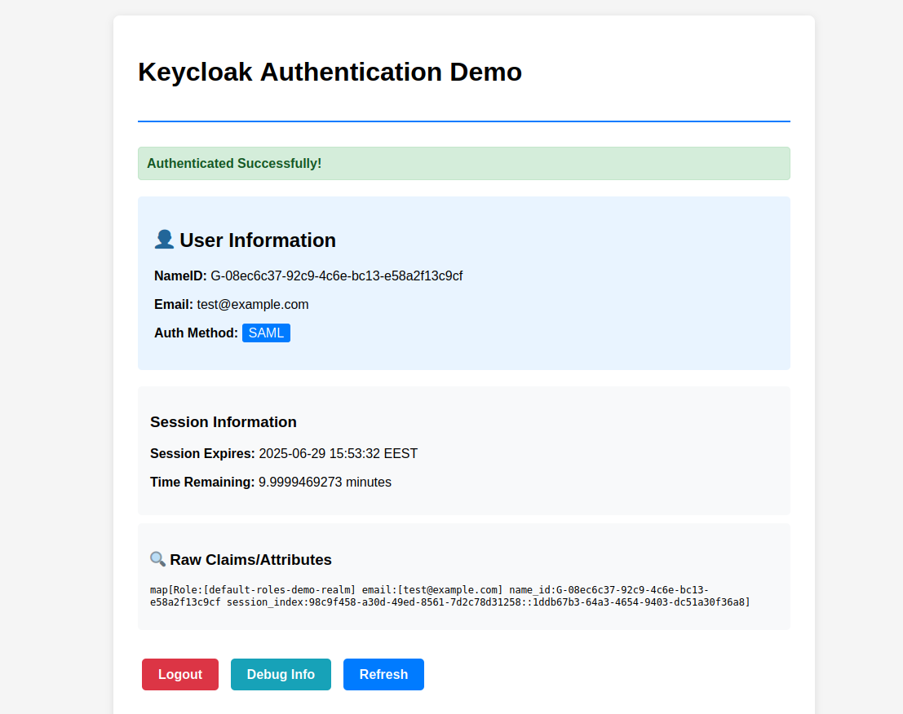

# Keycloak SAML2.0 Demo

A demonstration repo showcasing SAML Single Sign-On (SSO) integration between Keycloak as Identity Provider (IdP) and a simple Go-based Service Provider (SP).
(SP initiated)

## Overview




This project demonstrates how to set up SAML authentication using:
- **Keycloak 22.0** as the Identity Provider (IdP)
- **PostgreSQL 15** as the Keycloak database
- **Go application** as the Service Provider (SP)

The setup uses HTTP-only configuration for development purposes (HTTPS is disabled by default but can be used with self signed / trusted certs).

## Prerequisites

- Docker and Docker Compose
- Go 1.19+ 
- `jq` 
- `curl` 

## Project Structure

```
.
├── docker-compose.yml          # Container orchestration
├── setup-keycloak.sh          # Keycloak configuration script
├── config.yaml                # Go application configuration
├── main.go                    # Main application entry point
├── sso.go                    # SAML authentication handlers
├── config.go                  # Configuration parsing and validation
├── utils.go                   # Utility functions and helpers
├── server.crt                 # SSL certificate for SP signing/HTTPS
├── server.key                 # SSL private key for SP signing/HTTPS
├── templates/                 # HTML templates
└── README.md                  # This file
```

## Quick Start

### 1. Start the Infrastructure

Launch Keycloak and PostgreSQL containers:

```bash
docker-compose up -d
```

This will start:
- **PostgreSQL** on default port (internal)
- **Keycloak** on [http://0.0.0.0:8080](http://localhost:8080)

### 2. Configure Keycloak

Wait for Keycloak to fully start, then run the configuration script:

```bash
chmod +x setup-keycloak.sh
./setup-keycloak.sh
```

This script will:
- Create a demo realm (`demo-realm`) in keycloack  
- Configure SAML client settings for our GO simple service provider app 
- Set up SAML client scope attributes
- Create a test user 
- Configure SSO session timeouts (10 minutes)

### 3. Start the Go Application

Run the Go-based Service Provider:

```bash
go run .
```

The application will be available at [http://localhost:8081](http://localhost:8081)

## Configuration Details

### Docker Compose Services

#### PostgreSQL Database
- **Image**: `postgres:15`
- **Database**: `keycloak`
- **Credentials**: `keycloak/password`
- **Data persistence**: `postgres_data` volume

#### Keycloak Identity Provider
- **Image**: `quay.io/keycloak/keycloak:22.0`
- **Admin credentials**: `admin/admin`  
- **Port**: `8080` (configurable via `KEYCLOAK_PORT`)
- **Mode**: Development (`start-dev`)
- **Features**: Metrics and health checks enabled

### Application Configuration (config.yaml)

```yaml
SCHEME: http
KEYCLOAK_URL: localhost:8080
REALM: demo-realm
BASE_URL: localhost:8081
SAML_ENTITY_ID: localhost:8081/saml/metadata
SAML_METADATA_URL: localhost:8080/realms/demo-realm/protocol/saml/descriptor
SESSION_SECRET: qZ9$Lp#j3X!8VwT&rS6mA^eBtN2u@yFb
MAX_SESSION_AGE: 600
INSECURE_SKIP_VERIFY: true
```


## SAML Configuration

The setup script configures the following SAML settings:

### Client Configuration
- **Entity ID**: `http://localhost:8081/saml/metadata`
- **ACS URL**: `http://localhost:8081/auth/saml/acs`
- **SLO URL**: `http://localhost:8081/auth/saml/slo`
- **Signature Algorithm**: RSA_SHA256
- **Assertion Signature**: Enabled
- **Server Signature**: Enabled

## Test User

A test user is automatically created during setup:

- **Username**: `testuser`
- **Password**: `password`
- **Email**: `test@example.com`
- **Name**: Test User

## Application Components

### Go Files (main pkg)

#### main.go
- Application entry point and HTTP server setup
- Gin router configuration and middleware setup
- Session store initialization
- SSL/TLS configuration for HTTPS mode
- Route definitions and server startup logic

#### sso.go  
- SAML authentication handlers and SSO logic
- Login/logout flow implementation
- SAML assertion processing
- Session management for authenticated users
- Callback handlers for SAML responses

#### config.go
- Configuration file parsing and validation
- Configuration validation and defaults

#### utils.go
- Utility functions and helper methods


### SSL Certificates

#### server.crt & server.key (are self signed for demo purposes)
These certificates serve multiple purposes:
- **SAML Signing**: Used by the Service Provider to sign SAML requests
- **HTTPS Server**: Enables SSL/TLS when `SCHEME: https` in the config yaml file


## Application Routes

The Go application provides the following endpoints:

- `GET /` - Home page
- `GET /login` - Login page
- `GET /auth/saml/login` - Initiate SAML login
- `POST /auth/saml/acs` - SAML assertion consumer service
- `GET /auth/saml/metadata` - SAML SP metadata
- `GET /auth/saml/slo` - SAML single logout callback
- `GET /logout` - Logout endpoint
- `GET /debug` - Debug information


## Session Management

- **Session Duration**: 10 minutes (600 seconds)
- **Cookie Settings**: HttpOnly, Secure, SameSite=Lax
- **Storage**: Cookie-based sessions

**Note**: Session timeout is configured both in Keycloak (SSO session) and the Go application (cookie session) to maintain consistency.
Always ensure that the MAX_SESSION_AGE (config.yaml) is equal to the keycloack idp SSO session timeouts in the setup-keycloack script


## Development Tools

### SAML Debugging

**Tip**: Use the SAML-Tracer browser extension to inspect SAML requests and responses during development:

- **Firefox**: [SAML-Tracer Extension](https://addons.mozilla.org/en-US/firefox/addon/saml-tracer/)
- **Chrome**: Search for "SAML Tracer" in Chrome Web Store

This extension helps you:
- View SAML authentication requests
- Inspect SAML assertions and responses
- Debug attribute mappings
- Troubleshoot authentication flows


